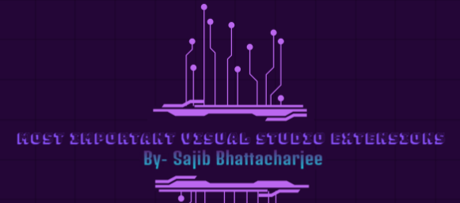

<div align="center">
 


## `Most Important Visual Studio Extensions`

</div>

```js
        1. Atom One Dark Theme
        2. Auto Close Tag
        3. .gitignore Generator
        4. Auto Import
        5. Auto Rename Tag
        6. Beautify css/sass/scss/less
        7. Better Comments
        8. Bootstrap 4, Font awesome 4, Font Awesome 5 Free & Pro snippets
        9. Bootstrap 5 & Font Awesome Snippets
        10. Bracket Pair Color DLW
        11. Bracket Pair Colorization Toggler
        12. Code Runner
        13. Color Highlight
        14. CSS Compressor
        15. CSS Flexbox Cheatsheet
        16. CSS Peek
        17. CSS Tree
        18. Dummy Text Generator
        19. ES7+ React/Redux/React-Native snippets
        20. ESLint
        21. formate: CSS/LESS/SCSS formatter
        22. Git History
        23. HTML Format
        24. HTML to CSS autocompletion
        25. IntelliSense for CSS class names in HTML
        26. JavaScript (ES6) code snippets
        27. Live Sass Compiler
        28. Live Server
        29. Markdown Preview Github Styling
        30. markdownlint
        31. Material Icon Theme
        32. Prettier - Code formatter
        33. Sass (.sass only)
        34. Thunder Client

```

<div align="center">

### `Created By-->`

**&copy;`-Sajib Bhattacharjee`**

**`Dedicated for My Dear!!! 💕"Zahan"💕`**

> > > > ### Thanks A Lot For Visiting...!!!

</div>
